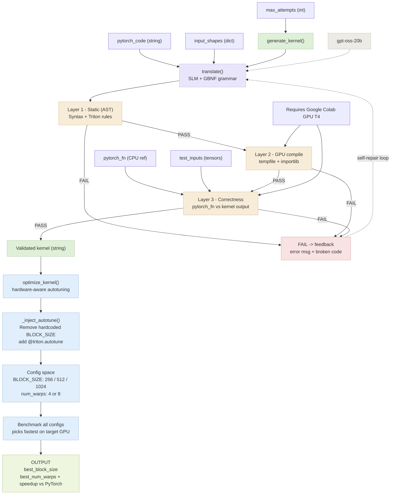

# llm-gpu-kernel-generation

Automated generation of optimized GPU kernels in Triton using small language models with constrained grammar and multi-layer validation.

## The Problem

Modern LLMs can generate code in dozens of languages, but ask them to write GPU kernels and they struggle:
- Generated kernels have syntax errors or invalid Triton constructs
- Code compiles but has memory bugs or race conditions  
- Code is correct but painfully slow

You need a system that guarantees correctness *and* performance—not just one or the other.

## The Approach

Instead of using massive models (670B+), we use a **small LLM** (~20B) with intelligent guardrails:

1. **Constrained Generation (GBNF)**: Grammar rules prevent the model from generating invalid Triton structure at token-level
2. **3-Layer Validation**: Static checks → GPU compilation → numerical correctness
3. **Self-Repair Loop**: When validation fails, feed the exact error back to the model so it can fix itself

The hypothesis: **a small model with the right infrastructure outperforms a large model with none**.

## Quick Start

### Installation

```bash
git clone https://github.com/casrhub/llm-gpu-kernel-generation.git
cd llm-gpu-kernel-generation
pip install -r requirements.txt
export FIREWORKS_API_KEY=your_api_key_here
```

### Run a Campaign

Generate and benchmark 25 GPU kernels across different sizes:

```bash
python benchmark/run_campaign.py \
  --tracks method,baseline \
  --method-model accounts/fireworks/models/gpt-oss-20b \
  --baseline-model accounts/fireworks/models/deepseek-v4-0 \
  --sizes 1024,2048,4096 \
  --repeats 2 \
  --optimize
```

For a quick validation (no API calls):
```bash
python benchmark/run_campaign.py \
  --tracks method \
  --sizes 1024 \
  --repeats 1 \
  --dry-run
```

Results are saved as JSON in `benchmark/results_campaign/` with a manifest summarizing all runs.

## How It Works



Each validation layer is stricter than the last. The model gets up to 3 repair attempts before an operation is marked as failed.

## Project Structure

```
src/
  translator/
    pytorch_to_triton.py     # Main pipeline: generation + validation + repair
  baselines/
    baseline_runner.py       # Baseline: direct prompting, no guardrails

benchmark/
  operations.py              # 25 GPU operations (elementwise, reduction, compound)
  run_campaign.py            # Extended benchmark runner: multi-size/seed/model
  run_method.py              # Evaluate proposed method
  run_baseline.py            # Evaluate baseline approach
  results_campaign/          # Output JSONs and manifests

report/                       # LaTeX + analysis scripts
test_*.py                     # Unit tests
```

## Benchmarking

The campaign runner evaluates:
- **25 operations** across 3 categories (elementwise, reduction, compound)
- **Multiple vector sizes** (1024 to 8192 elements)
- **Multiple models** (method: gpt-oss-20b, baseline: deepseek-v4-0)
- **Auto-tuning** for `BLOCK_SIZE` optimization per operation

Output metrics per operation:
- Success rate (generation + validation passed)
- Compilation errors, validation errors
- Speedup vs PyTorch (with optimized `BLOCK_SIZE`)
- Number of repair attempts needed

Sample command for targeting specific categories:
```bash
python benchmark/run_campaign.py \
  --categories reduction \
  --sizes 1024,2048,4096 \
  --repeats 3 \
  --optimize \
  --output-tag reduction_deep
```

## Requirements

- Python 3.10+
- PyTorch 2.0+
- Triton (NVIDIA GPUs only)
- Fireworks AI API key (for LLM calls)

Tested on: NVIDIA T4 (Colab), A100

## Key Files

- **[src/translator/pytorch_to_triton.py](src/translator/pytorch_to_triton.py)**: Core generation + validation logic
- **[benchmark/run_campaign.py](benchmark/run_campaign.py)**: Campaign runner with multi-size/seed/model support
- **[benchmark/operations.py](benchmark/operations.py)**: Benchmark operations and PyTorch reference implementations

